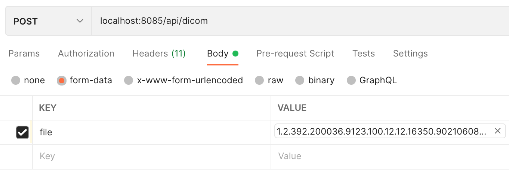
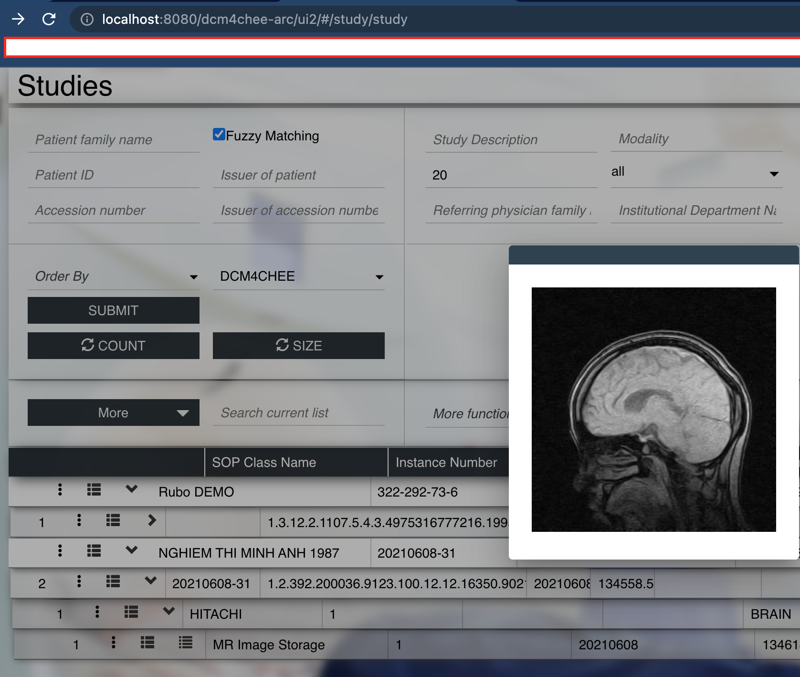

# DICOM demo

## PREREQUIRE
1.  Dcm4chee archive is running

## UPLOAD DICOM FILE TO DCM4CHEE ARCHIVE 5

### In postman

1.  In headers, set <b>Content-type</b> to <b>multipart/form-data</b>
2.  In body, click form-data and upload DICOM file

### Result

## VIEW
1.  [Embedded Viewer](https://docs.ohif.org/deployment/recipes/embedded-viewer.html)

## DOCS
- [X] [setup dcm4chee-arc](https://github.com/dcm4che-dockerfiles/dcm4chee-arc-psql) 
- [X] [API](https://petstore.swagger.io/index.html?url=https://raw.githubusercontent.com/dcm4che/dcm4chee-arc-light/master/dcm4chee-arc-ui2/src/swagger/openapi.json#/QIDO-RS/SearchForStudies)
- [X] [dicom attribute](https://climserv.ipsl.polytechnique.fr/documentation/idl_help/DICOM_Attributes.html)
- [X] [dicom wiki](https://github.com/dcm4che/dcm4chee-arc-light/wiki)
