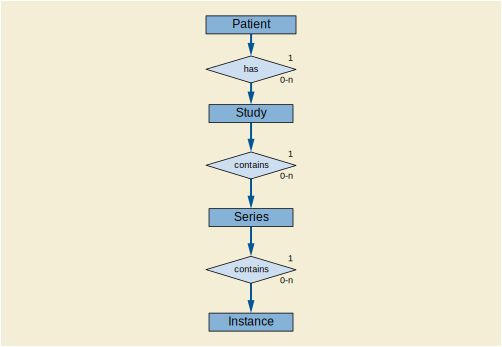

# [SOP class definitions](https://dicom.nema.org/medical/dicom/2017b/output/chtml/part04/sect_C.6.html#sect_C.6.1.1)

## C.6.1.1 Patient Root Query/Retrieve Information Model
### C.6.1.1.1 E/R Model

*Figure C.6-1. Patient Root Query/Retrieve Information Model E/R Diagram*